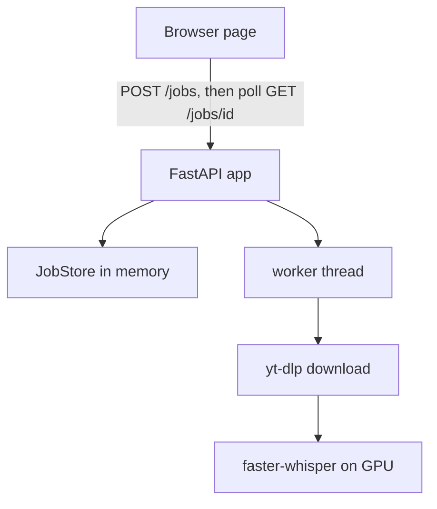

# Architecture

The macro technical shape: the stack, how the pieces fit, and the decisions behind them. Point to the code, do not restate it. The full decision record, with alternatives and measures, is `aidd_docs/memory/internal/decisions/stack.md`.

## Stack

- Python and FastAPI for the backend, because faster-whisper is Python and a second runtime would need a bridge.
- A single HTML page with vanilla JS and Tailwind through its Play CDN, served by FastAPI. No front build.
- faster-whisper with the `large-v3-turbo` model in float16, called inside the API process.
- yt-dlp with `deno` for the audio download. No ffmpeg, PyAV decodes the audio.
- Docker Compose with an NVIDIA GPU reservation.

## How it fits together

## Key decisions

- The model loads once at startup, in the FastAPI lifespan, and the page is served only after that.
- A job runs in a thread and the page polls every 2 s, so no request waits for minutes.
- One job at a time, because there is one GPU. The second request gets `409`.
- Jobs live in memory only, the last 20 are kept, and a restart loses them.
- No language select. Whisper detects the language and translation is left to the downstream skill.
- yt-dlp is locked in `uv.lock` and upgraded at build, so a `--no-cache` rebuild still follows YouTube changes.
- A change that departs from the ADR needs a new ADR first.

## Gotchas

- PyAV stays in `>=15,<16`, version 19 breaks faster-whisper with a `metadata_errors` error.
- `entrypoint.sh` computes `LD_LIBRARY_PATH` from `__path__`, because the `nvidia` packages are namespaces and their `__file__` is `None`.
- yt-dlp needs `deno`, without it YouTube hides formats.
- `build_app` is the uvicorn factory. Tests call `create_app` with fakes, so they import without a GPU.
