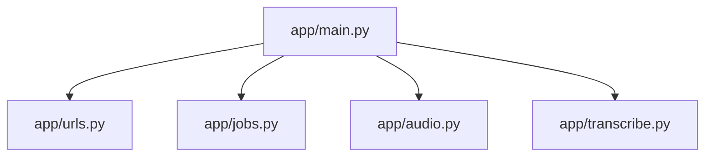

# Codebase Map

The macro layout: the top-level areas and what each holds. A map to navigate, not the full tree.

## Areas

- `app/`: the backend. `main.py` wires the routes, `urls.py` validates the YouTube URL, `jobs.py` holds the job state, `audio.py` downloads, `transcribe.py` runs Whisper, `fake.py` holds the fake transcriber and downloader used when `YT_FAKE=1`.
- `app/static/`: the page, served at `/` and `/static`. `index.html` holds the markup, the Tailwind directives and the theme script of the `<head>`, `theme.css` the theme variables, `app.js` the transcription and the theme button.
- `tests/`: pytest suites for the job flow, the URL parsing, the fake mode and the static files, run by `scripts/check.sh`.
- `e2e/`: Playwright scenarios for the page, run by `scripts/e2e.sh fake|real`, outside `scripts/check.sh`.
- `aidd_docs/`: the AI memory, the decision records under `memory/internal/decisions/`, and the task plans.
- Repo root: `Dockerfile`, `compose.yaml`, `entrypoint.sh` for the container, and `scripts/` (`check.sh`, `e2e.sh`).

## Entry points

- `app/main.py`, function `build_app`, started by `uvicorn --factory`.
- `entrypoint.sh`, which sets the CUDA library path and then execs the command.
