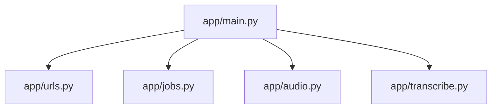

# Codebase Map

The macro layout: the top-level areas and what each holds. A map to navigate, not the full tree.

## Areas

- `app/`: the backend. `main.py` wires the routes, `urls.py` validates the YouTube URL, `jobs.py` holds the job state, `audio.py` downloads, `transcribe.py` runs Whisper.
- `app/static/`: the single page, `index.html`.
- `tests/`: pytest suites for the job flow and the URL parsing.
- `docs/`: `adr/` for decisions, `ameliorations.md` for the backlog.
- `aidd_docs/`: the AI memory and the task plans.
- Repo root: `Dockerfile`, `compose.yaml`, `entrypoint.sh` for the container.

## Entry points

- `app/main.py`, function `build_app`, started by `uvicorn --factory`.
- `entrypoint.sh`, which sets the CUDA library path and then execs the command.
