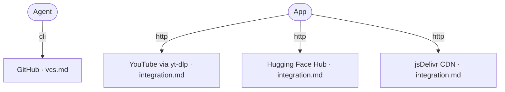

# Ecosystem

```mermaid
flowchart TD
  Agent([Agent])
  App([App])
  Vcs["GitHub · vcs.md"]
  YouTube["YouTube via yt-dlp · integration.md"]
  Hub["Hugging Face Hub · integration.md"]
  Cdn["jsDelivr CDN · integration.md"]

  Agent -- cli --> Vcs
  App -- http --> YouTube
  App -- http --> Hub
  App -- http --> Cdn
```
