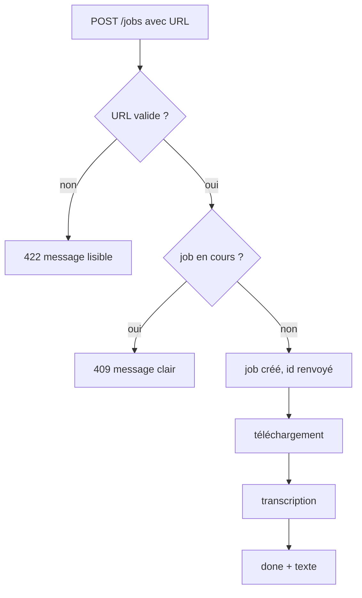
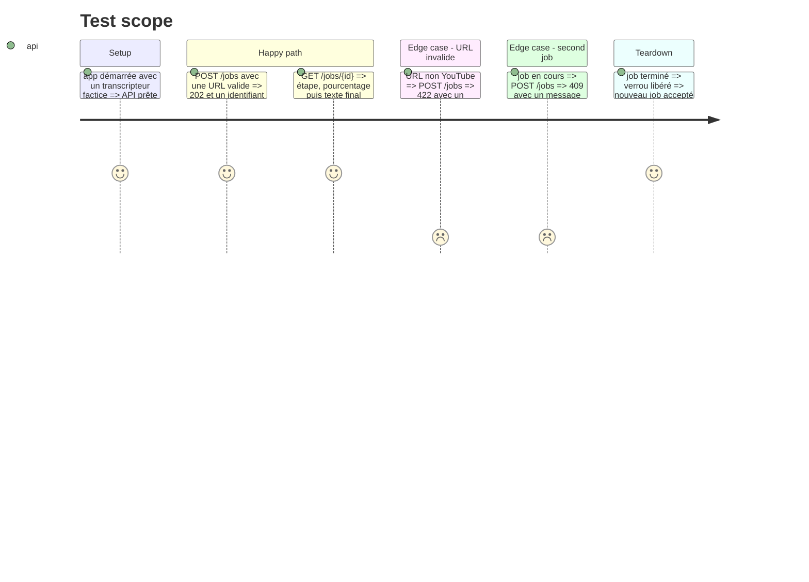

# Instruction: Backend API, jobs, audio, Whisper

## Architecture projection

> Tree of the final files. ✅ create · ✏️ modify · ❌ delete

```txt
.
├── app/
│   ├── __init__.py          ✅
│   ├── main.py              ✅ FastAPI, routes, chargement du modèle au démarrage
│   ├── urls.py              ✅ validation d'une URL YouTube
│   ├── jobs.py              ✅ machine à états du job, verrou « un seul job »
│   ├── audio.py             ✅ téléchargement yt-dlp
│   └── transcribe.py        ✅ faster-whisper, progression, hotwords
├── tests/
│   ├── test_urls.py         ✅
│   └── test_jobs.py         ✅
├── requirements.txt         ✅ faster-whisper==1.2.1, av>=15,<16, yt-dlp, deno, fastapi, uvicorn
└── requirements-dev.txt     ✅ pytest, httpx
```

## User Journey



## Test Scope



## Tasks to do

### `1)` Validation d'URL

> Rejeter tout ce qui n'est pas une URL de vidéo YouTube, avant tout téléchargement.

1. Accepter `youtube.com/watch?v=`, `youtu.be/`, `youtube.com/shorts/`, `m.youtube.com`.
2. Rejeter les autres hôtes, les schémas non http(s) et les chaînes vides, avec un message en français.

### `2)` Jobs

> Un job a une étape, un pourcentage, un texte et une erreur, et un seul job tourne à la fois.

1. États : `queued`, `downloading`, `transcribing`, `done`, `error`.
2. `start()` lève une erreur dédiée si un job est actif, libère le verrou en `done` et en `error`.

### `3)` Audio et Whisper

> Télécharger l'audio puis transcrire sur le GPU avec les réglages de l'ADR.

1. `yt-dlp -f bestaudio` dans un dossier temporaire, nettoyé ensuite. Toute erreur yt-dlp devient un message lisible.
2. `WhisperModel("large-v3-turbo", device="cuda", compute_type="float16")` chargé une fois au démarrage.
3. `transcribe(language=None, beam_size=5, vad_filter=True, condition_on_previous_text=False, hotwords=...)`, hotwords lus dans `HOTWORDS`, défaut « Claude Code, Claude, Anthropic, MCP ».
4. Pourcentage = `segment.end / info.duration`. Texte = segments joints par un espace, sans horodatage.

### `4)` Routes

> `POST /jobs`, `GET /jobs/{id}`, et la page statique à la racine.

1. `POST /jobs` renvoie 202 et `{id}`, ou 422 (URL), ou 409 (job en cours).
2. `GET /jobs/{id}` renvoie `{stage, progress, text, error}`, ou 404.
3. Le travail tourne dans un thread, l'API reste réactive.

## Test acceptance criteria

| Task | Acceptance criteria                                                                  |
| ---- | ------------------------------------------------------------------------------------ |
| 1    | Les URL YouTube usuelles passent, `https://example.com/x` et `abc` sont refusées     |
| 2    | Un second `start()` pendant un job échoue, puis réussit une fois le premier terminé  |
| 3    | Une URL YouTube inexistante produit un job `error` avec un message lisible           |
| 4    | `POST /jobs` renvoie 202, 422 ou 409 selon le cas, et `GET` d'un id inconnu renvoie 404 |
