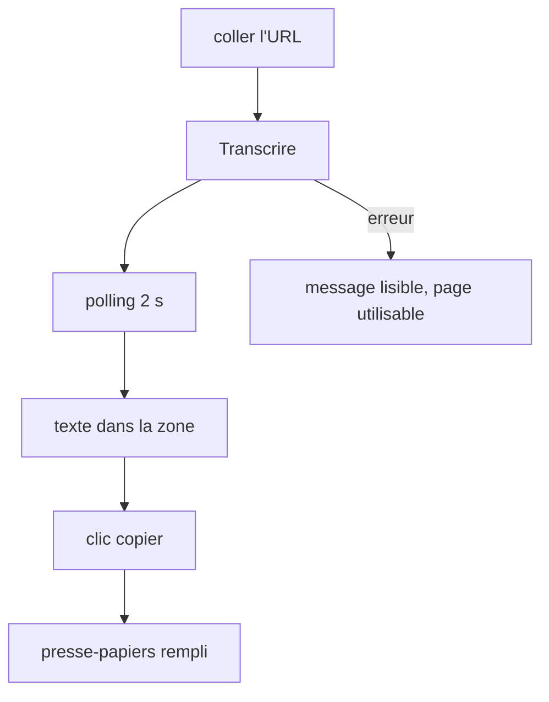
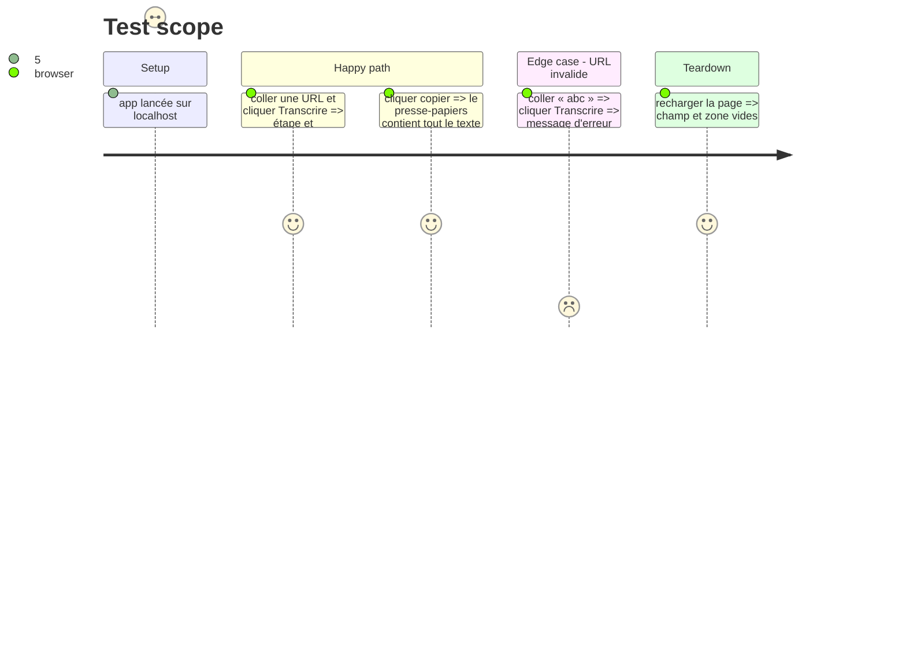

# Instruction: Front, page unique et bouton copier

## Architecture projection

> Tree of the final files. ✅ create · ✏️ modify · ❌ delete

```txt
.
└── app/
    ├── main.py                 ✏️ sert la page à la racine
    └── static/
        └── index.html          ✅ HTML + JS vanilla + Tailwind Play CDN
```

## User Journey



## Test Scope



## Wireframe

```txt
┌──────────────────────────────────────────────┐
│ yt-transcriber                               │
│ [ https://youtube.com/watch?v=...  ] [Transcrire] │
│ étape : transcription · 42 %                 │
│ ┌──────────────────────────────────── [⧉] ┐ │
│ │ (texte brut)                             │ │
│ │                                          │ │
│ └──────────────────────────────────────────┘ │
└──────────────────────────────────────────────┘
```

## Tasks to do

### `1)` Page

> Un champ, un bouton, une zone de texte, un bouton copier.

1. Tailwind via `https://cdn.jsdelivr.net/npm/@tailwindcss/browser@4`.
2. `<textarea readonly>` grande, bouton copier avec l'icône SVG inline des deux feuilles superposées (aucune librairie).

### `2)` Logique

> Lancer, interroger, afficher, copier, signaler les erreurs.

1. `POST /jobs`, puis `GET /jobs/{id}` toutes les 2 s jusqu'à `done` ou `error`.
2. Afficher l'étape et le pourcentage, désactiver le bouton pendant le job.
3. Copier avec `navigator.clipboard.writeText`, repli `execCommand("copy")` hors contexte sécurisé, retour visuel « copié ».
4. Afficher le message du serveur (422, 409, erreur de job) dans une zone d'erreur visible.

## Test acceptance criteria

| Task | Acceptance criteria                                                                   |
| ---- | ------------------------------------------------------------------------------------- |
| 1    | La page s'affiche sur `/` avec champ, bouton, zone de texte et icône des deux feuilles |
| 2    | Un clic sur copier place l'intégralité du texte dans le presse-papiers                |
| 2    | Une URL invalide affiche un message lisible et le bouton redevient actif              |
