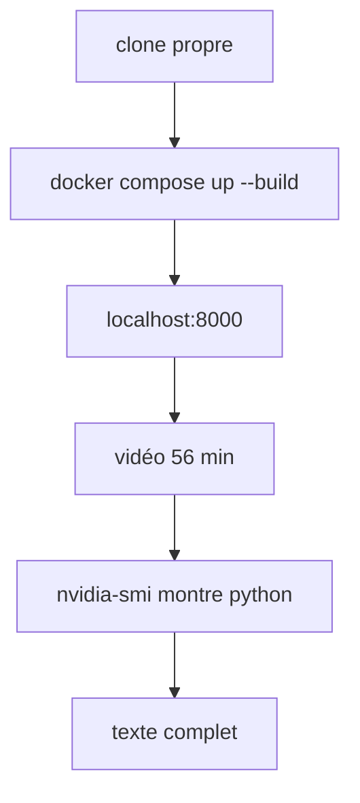
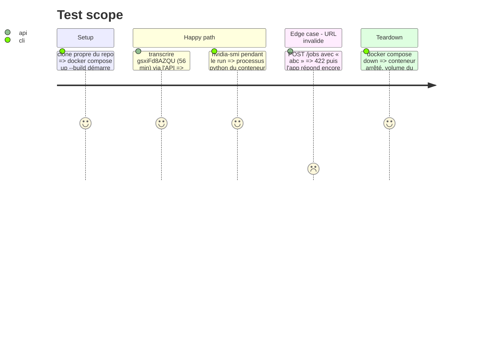

# Instruction: Packaging Docker, README, git, e2e GPU

## Architecture projection

> Tree of the final files. ✅ create · ✏️ modify · ❌ delete

```txt
.
├── Dockerfile               ✅ python:3.12-slim, pip nvidia-cublas-cu12 + nvidia-cudnn-cu12==9.*, LD_LIBRARY_PATH calculé
├── compose.yaml             ✅ un service, réservation GPU nvidia, volume nommé HF_HOME, port 8000
├── .dockerignore            ✅
├── .gitignore               ✅
└── README.md                ✅ une commande de lancement, vidéo de test, durée et temps mesurés
```

## User Journey



## Test Scope



## Tasks to do

### `1)` Image et Compose

> Une commande, `docker compose up --build`, sert la page sur `localhost:8000` avec le GPU.

1. `Dockerfile` : `LD_LIBRARY_PATH` calculé par `list(nvidia.cublas.lib.__path__)[0]` et idem cudnn, yt-dlp sans version figée.
2. `compose.yaml` : `deploy.resources.reservations.devices` (`driver: nvidia`, `count: all`, `capabilities: [gpu]`), volume nommé pour `HF_HOME`.

### `2)` README

> Lancement, usage, mesure.

1. Commande unique, prérequis (Docker, nvidia-container-toolkit, GPU), variable `HOTWORDS`, reconstruction `--no-cache` pour suivre YouTube.
2. Vidéo de test, durée et temps de transcription mesurés pendant le run réel.

### `3)` Git

> Dépôt initialisé, remote posé, historique propre.

1. `git init` sur `main`, `.gitignore` (`__pycache__`, `.venv`, `.pytest_cache`), remote `git@github.com:kevpdev/yt-transcriber.git`.
2. Commits Conventional Commits en anglais, sans mention d'outil.

### `4)` Validation e2e réelle

> Prouver les critères sur le vrai système (Docker + GPU), pas un montage jetable.

1. Depuis un clone propre, `docker compose up --build`, transcription de `gsxiFd8AZQU` (56 min).
2. Relever `nvidia-smi` pendant le run, noter les temps dans le README.
3. Vérifier le copier dans un navigateur réel, et l'URL invalide.

## Test acceptance criteria

| Task | Acceptance criteria                                                              |
| ---- | -------------------------------------------------------------------------------- |
| 1    | `docker compose up --build` sert la page sur `localhost:8000` depuis un clone propre |
| 2    | Le README donne une seule commande et la durée et le temps de la vidéo de test   |
| 3    | `git log` montre au moins un commit et `git status` est propre                   |
| 4    | `nvidia-smi` montre `python` sur le GPU pendant la transcription de 56 min       |
