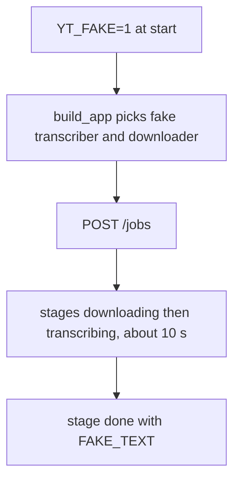
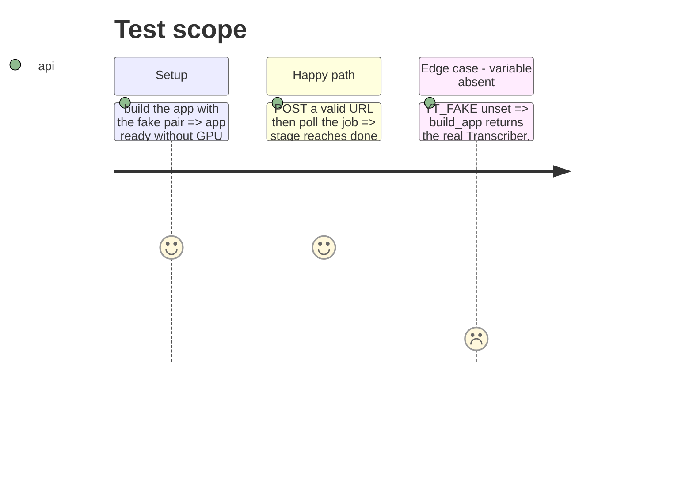

<!-- Fill or omit these sections; never add, rename, or reorder one. -->

# Instruction: Fake mode switched by an env variable

## Architecture projection

> Tree of the final files. ✅ create · ✏️ modify · ❌ delete

```txt
.
├── app/
│   ├── fake.py            ✅ FakeTranscriber, fake_download, FAKE_TEXT
│   └── main.py            ✏️ build_app reads YT_FAKE
└── tests/
    └── test_fake.py       ✅ fake mode behavior, no GPU
```

## User Journey



## Test Scope

<!-- Required for every phase. Keep Setup, Happy path, any qualifying Edge cases, and any required Teardown in this one journey. -->



## Tasks to do

### `1)` Fake pair

> A transcriber and a downloader that need no GPU and no network, slow enough to reload and cut the network mid-job.

1. Create `app/fake.py`: `FAKE_TEXT` (a few sentences), `fake_download(url, dest_dir)` writing an empty file and returning its path, `FakeTranscriber` with `model = object()` so the lifespan skips `load()`, and `run(audio, on_progress)` that reports progress in steps over about 10 s and returns `FAKE_TEXT`.
2. Keep the duration a module constant, so tests can patch it to zero.

### `2)` Switch in `build_app`

> `YT_FAKE=1` is the only way to get the fake pair.

1. In `app/main.py`, `build_app` returns `create_app(FakeTranscriber(), fake_download)` when `os.environ.get("YT_FAKE") == "1"`, else `create_app()` as today.
2. Leave `create_app` untouched and leave `compose.yaml` and the `Dockerfile` without the variable.

### `3)` Tests

> Fake mode stays covered, the 80 % threshold holds.

1. In `tests/test_fake.py`, drive `create_app(FakeTranscriber(), fake_download)` with `TestClient` and the `wait_for` helper style of `tests/test_jobs.py`, duration patched to zero.
2. Test `build_app` with `monkeypatch.setenv("YT_FAKE", "1")` returns an app that finishes a job, and with the variable unset keeps the real `Transcriber` (patch `Transcriber` so no model loads).

## Test acceptance criteria

<!-- Each criterion is an observable behavior, not a command. -->

| Task | Acceptance criteria                                                                                  |
| ---- | ---------------------------------------------------------------------------------------------------- |
| 1    | A job on the fake pair goes `downloading`, `transcribing`, `done` and returns `FAKE_TEXT`            |
| 2    | With `YT_FAKE` unset or not `1`, `build_app` builds the real `Transcriber`                           |
| 3    | `scripts/check.sh` passes end to end, coverage stays at or above 80 %                                |
