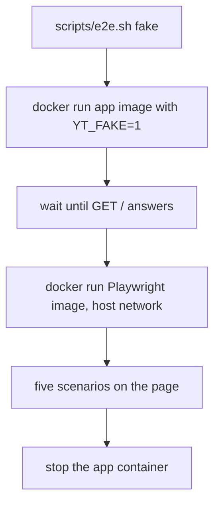
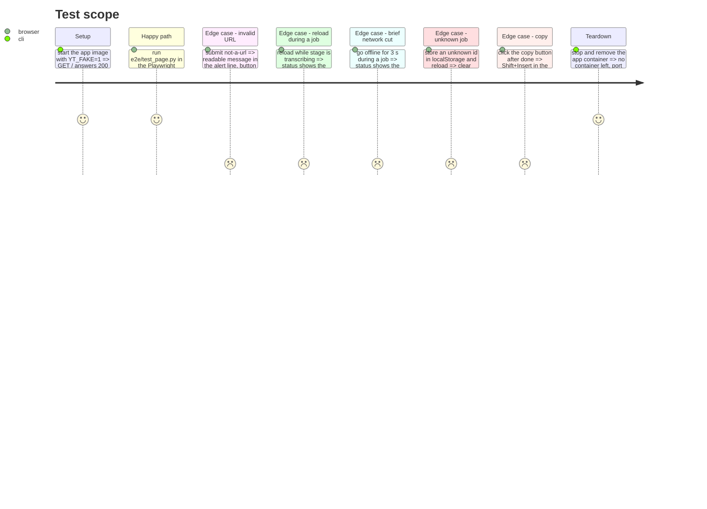

<!-- Fill or omit these sections; never add, rename, or reorder one. -->

# Instruction: Playwright suite and GPU-less runner

## Architecture projection

> Tree of the final files. ✅ create · ✏️ modify · ❌ delete

```txt
.
├── e2e/
│   ├── conftest.py        ✅ base URL, video URL, browser context options
│   ├── requirements.txt   ✅ pytest, pytest-playwright
│   └── test_page.py       ✅ the five scenarios
└── scripts/
    └── e2e.sh             ✅ fake level: app container plus Playwright container
```

## User Journey



## Test Scope

<!-- Required for every phase. Keep Setup, Happy path, any qualifying Edge cases, and any required Teardown in this one journey. -->



## Tasks to do

### `1)` Scenarios

> The five checks of the issue, one test each, same assertions on both levels.

1. `conftest.py`: fixtures `base_url` from `E2E_BASE_URL` (default `http://localhost:8000`) and `video_url` from `E2E_VIDEO_URL` (default a valid YouTube URL the fake accepts), Chromium launched with `--no-sandbox`, clipboard permissions granted on the context.
2. Invalid URL: type `not-a-url`, submit, expect `#error` non-empty, `#go` enabled, and `GET /` still 200.
3. Reload during a job: submit `video_url`, wait for a status containing `Transcription` or `Téléchargement`, `page.reload()`, expect `Reprise du job en cours…` then `Terminé.` and a non-empty `#out`.
4. Network cut: submit, `context.set_offline(True)`, expect `Connexion perdue, nouvelle tentative…`, go back online before the fifth failed poll (3 s, `MAX_RETRIES` is 5 at 2 s), expect `Terminé.`.
5. Unknown job: set `localStorage["yt-transcriber-job"]` to an unknown id with `page.evaluate`, reload, expect the `Ce job n'existe plus` message, the key null, `#go` enabled.
6. Copy: after `Terminé.`, click `#copy`, focus `#url`, press `Shift+Insert`, expect its value to equal `#out`'s full value (`Ctrl+V` pastes nothing in headless Chromium, measured during the MVP).

### `2)` Runner

> One command for the GPU-less level, like `scripts/check.sh`.

1. `scripts/e2e.sh fake`: build the app image, `docker run -d --rm -e YT_FAKE=1 --network host`, poll `GET /` until it answers, run the Playwright image with `--network host`, the `e2e/` folder mounted read-only and copied inside, `pip install -r e2e/requirements.txt`, then `pytest e2e`.
2. Stop the app container in a `trap`, so a failing run leaves nothing behind. Exit with the pytest status.
3. Pin the Playwright image tag to the `pytest-playwright` version resolved at implementation time, and note it in the script.

## Test acceptance criteria

<!-- Each criterion is an observable behavior, not a command. -->

| Task | Acceptance criteria                                                                                         |
| ---- | ----------------------------------------------------------------------------------------------------------- |
| 1    | Each of the five scenarios fails when its page behavior is broken, checked by one deliberate break per test |
| 2    | `scripts/e2e.sh fake` passes on a machine without GPU access and leaves no container behind                 |
| 2    | `scripts/check.sh` is unchanged and still passes, `e2e/` is outside its scope                               |
