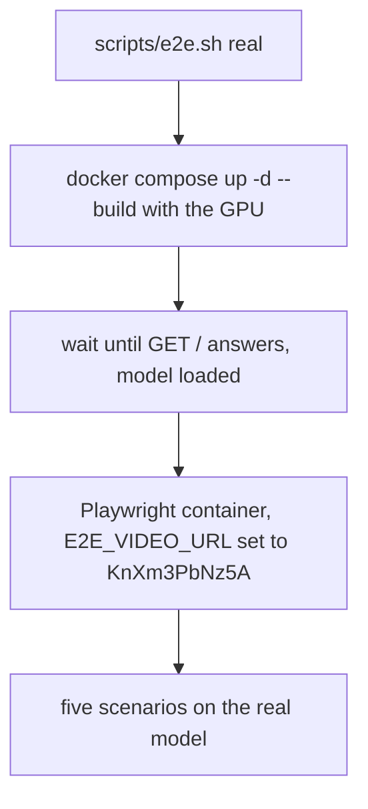
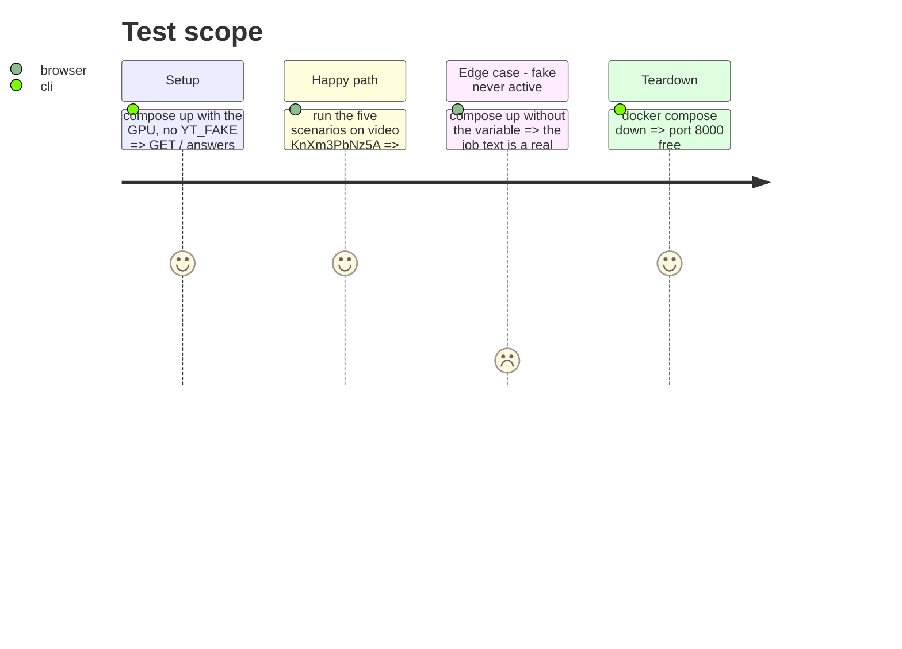

<!-- Fill or omit these sections; never add, rename, or reorder one. -->

# Instruction: Real-model level and memory update

## Architecture projection

> Tree of the final files. ✅ create · ✏️ modify · ❌ delete

```txt
.
├── scripts/
│   └── e2e.sh                         ✏️ add the `real` level
├── README.md                          ✏️ how to run both levels
└── aidd_docs/memory/
    └── testing.md                     ✏️ e2e section, the real path now has a check
```

## User Journey



## Test Scope

<!-- Required for every phase. Keep Setup, Happy path, any qualifying Edge cases, and any required Teardown in this one journey. -->



## Tasks to do

### `1)` Real level

> The same suite against the real service, the level the issue says no throwaway mount replaces.

1. `scripts/e2e.sh real`: `docker compose up -d --build`, poll `GET /` (the page is served only after the model loads), run the Playwright container with `E2E_VIDEO_URL=https://www.youtube.com/watch?v=KnXm3PbNz5A`, then `docker compose down` in a `trap`.
2. Run it once on the machine with the GPU and record the duration and the pass count in the issue closing comment.

### `2)` Documentation

> The memory and the README tell the truth about what is tested.

1. `README.md`: the two commands and what each one needs (Docker alone, or Docker with the GPU).
2. `aidd_docs/memory/testing.md`: add an e2e section (`e2e/`, the two levels, `YT_FAKE`, outside `check.sh` and why), and fix the Strategy line that says no test covers the real model path.

## Test acceptance criteria

<!-- Each criterion is an observable behavior, not a command. -->

| Task | Acceptance criteria                                                                          |
| ---- | -------------------------------------------------------------------------------------------- |
| 1    | `scripts/e2e.sh real` passes the five scenarios on `KnXm3PbNz5A` and leaves port 8000 free   |
| 1    | With the stack up without `YT_FAKE`, the final text of a job is not `FAKE_TEXT`              |
| 2    | `README.md` and `testing.md` name both commands and no longer say the real path is unchecked |
