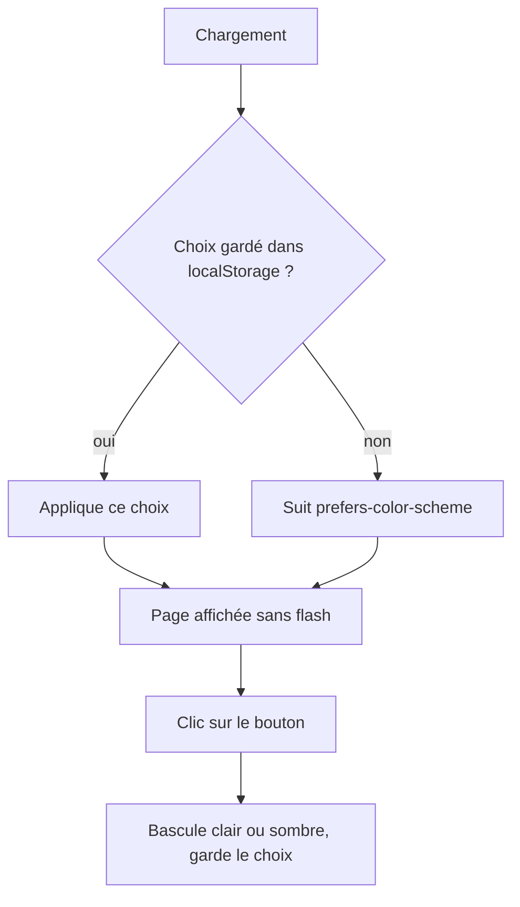
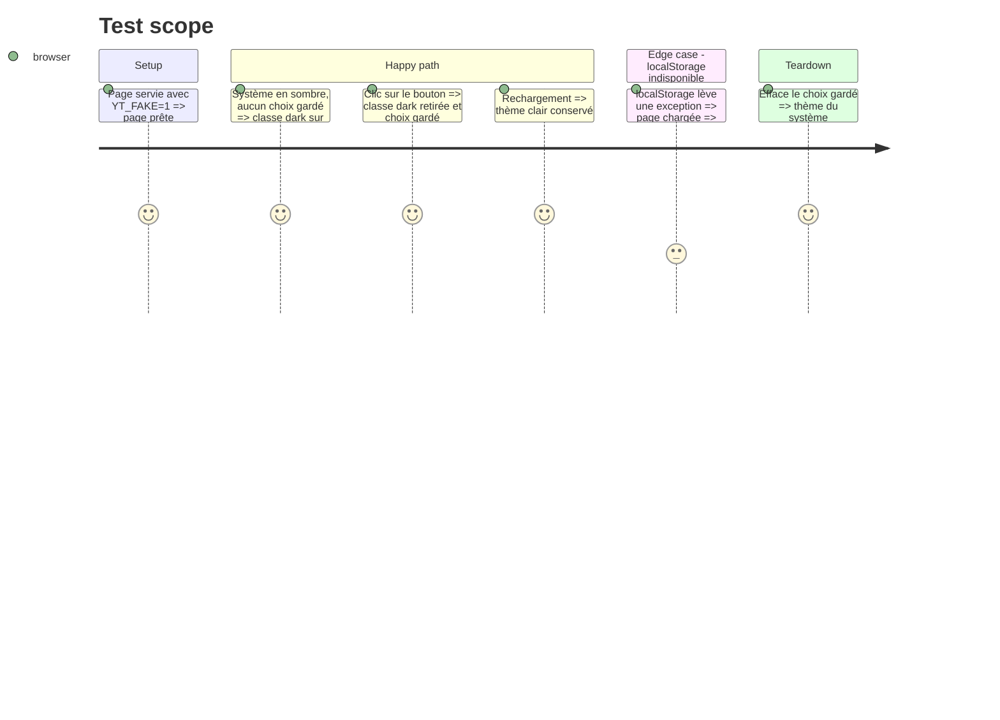

# Instruction: thème clair et sombre

## Architecture projection

```txt
.
├── app/static/index.html            ✏️ variables de thème, classes sémantiques, bouton, script de thème
└── aidd_docs/memory/design.md       ✏️ « Dark theme only » devient faux
```

## User Journey



## Test Scope



## Tasks to do

### `1)` Mesurer et fixer les couleurs

> Les ratios sont notés dans un commentaire, c'est un critère de l'issue.

1. Valeurs retenues, mesurées le 2026-10-07 (WCAG), à reconfirmer par un calcul avant de les figer :
   - clair : fond `#FAF8F5`, texte `#14181F`, action `#0C7C99` (blanc dessus 4,82), accent `#D6193F` (4,87 sur le fond), erreur `#B91C1C` (6,10)
   - sombre : fond `#14181F`, texte `#FAF8F5`, action `#0891B2` (texte sombre dessus 4,83), accent `#FB7185` (6,61), erreur `#F87171` (6,43)
   - texte atténué : mélange fond/texte à 68 % (5,95 en clair, 8,21 en sombre)
2. Écrire ces ratios dans un commentaire CSS au-dessus des variables.
3. Si un ratio recalculé passe sous son seuil (4,5 pour du texte, 3 pour un composant), ajuster la valeur et noter l'écart.

### `2)` Thème par variables

> Plus aucune classe `slate-*`, `sky-*` ni `red-*` dans la page.

1. Ajouter un `<style type="text/tailwindcss">` avec `@custom-variant dark (&:where(.dark, .dark *));`.
2. Définir les variables dans `:root` (clair) et `html.dark` (sombre), plus `color-scheme`.
3. Les exposer avec `@theme inline` (canvas, surface, bordure, texte, atténué, action, accent, erreur).
4. Remplacer les classes de couleur de la page par ces noms sémantiques. L'état de survol du bouton se déduit de l'action, sans quatrième couleur.

### `3)` Suivre le système et forcer un thème

> Le script de thème tourne avant l'affichage pour éviter un flash.

1. Script inline dans `<head>` : lit `yt-transcriber-theme` (try/catch), sinon `matchMedia("(prefers-color-scheme: dark)")`, puis pose ou retire la classe `dark`.
2. Bouton dans l'en-tête, avec `aria-label` et `aria-pressed`, qui bascule la classe et écrit le choix dans `localStorage` (try/catch).
3. Sans choix gardé, écouter le changement du système.
4. Aucune modification de la logique de transcription.

### `4)` Garder la mémoire vraie

> Consigne du projet : la mémoire suit le changement.

1. `aidd_docs/memory/design.md` : remplacer « Dark theme only » par les deux thèmes, la palette B et le bouton, mettre à jour « Tokens » (plus de « None ») et « Accessibility ».
2. Vérifier `README.md` et `aidd_docs/memory/forms.md` : toute mention d'un thème sombre unique ou du `localStorage` à compléter (la clé `yt-transcriber-theme`).

## Test acceptance criteria

| Task | Acceptance criteria                                                                                       |
| ---- | --------------------------------------------------------------------------------------------------------- |
| 1    | Un commentaire liste les ratios des deux thèmes, tous au-dessus de leur seuil                              |
| 2    | `grep -E "slate-|sky-|red-" app/static/index.html` ne renvoie rien                                         |
| 3    | Sans choix gardé la page suit le système, après un clic le choix survit au rechargement                    |
| 3    | `scripts/e2e.sh fake` passe, les cinq scénarios de #5 inchangés                                            |
| 4    | `design.md` ne dit plus « Dark theme only » et nomme la palette B                                          |
