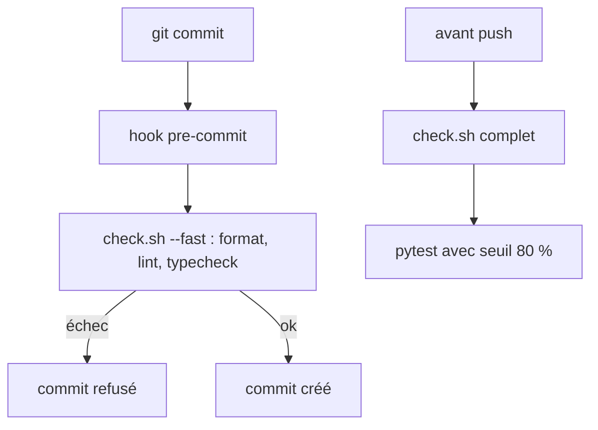
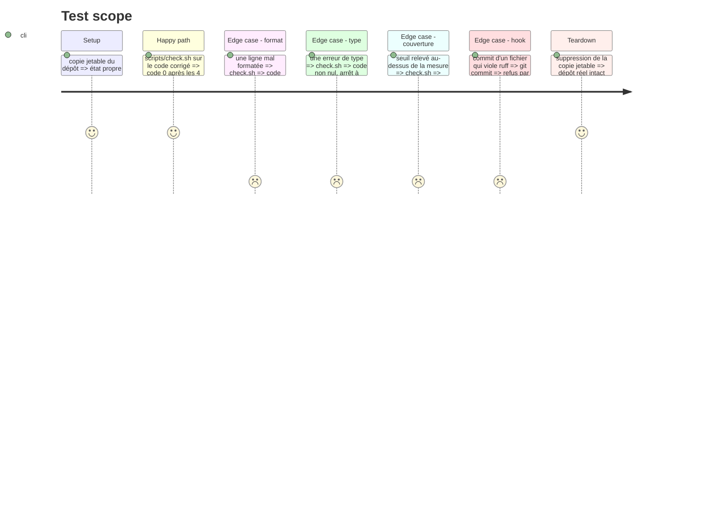

# Instruction: chaîne de contrôle et hook pre-commit

## Architecture projection

> Tree of the final files. ✅ create · ✏️ modify · ❌ delete

```txt
.
├── pyproject.toml                  ✅ config ruff, pyright, coverage
├── requirements-dev.txt            ✏️ ruff, pyright[nodejs], pytest-cov, runtime deps pour les types
├── scripts/
│   ├── check.sh                    ✅ chaîne 1 à 4, `--fast` pour 1 à 3
│   └── hooks/pre-commit            ✅ lance `check.sh --fast`
├── app/audio.py                    ✏️ typage de `params` yt-dlp
├── app/main.py                     ✏️ format, BLE001 justifié
├── app/transcribe.py               ✏️ `Callable` depuis collections.abc, garde sur `None`
├── app/urls.py                     ✏️ format
├── tests/test_jobs.py              ✏️ format, `body` initialisé
├── tests/test_urls.py              ✏️ format
├── aidd_docs/memory/coding-assertions.md  ✏️ mêmes commandes, 1 à 3 avant commit, 4 avant push
└── README.md                       ✏️ section Tests : `scripts/check.sh` et activation du hook
```

## User Journey



## Test Scope



## Tasks to do

### `1)` Config et dépendances

> Déclarer les outils et leurs réglages.

1. Créer `pyproject.toml` : `[tool.ruff]` (jeu de règles `E,F,I,UP,B,BLE`, à confirmer par la mesure), `[tool.pyright]` (`include = ["app", "tests"]`), `[tool.coverage.report] fail_under = 80`, `[tool.pytest.ini_options]` avec `--cov=app`.
2. Ajouter à `requirements-dev.txt` : `-r requirements.txt`, `ruff`, `pyright[nodejs]`, `pytest-cov`.

### `2)` Corriger ce que les outils relèvent

> Code actuel au vert avant d'ajouter le garde.

1. `ruff format .` puis `ruff check --fix`.
2. Typer `params` dans `app/audio.py`, garder `None` dans `app/transcribe.py:23`, initialiser `body` dans `tests/test_jobs.py:37`.
3. `except Exception` de `app/main.py:44` : conservé et annoté `# noqa: BLE001`, le commentaire existant dit pourquoi.

### `3)` Script et hook

> Une commande, un hook, dans un conteneur comme les tests actuels.

1. `scripts/check.sh` : `set -e`, `docker run` de `python:3.12-slim` sur une copie de travail (le montage est en lecture seule), étapes dans l'ordre, `--fast` s'arrête après l'étape 3.
2. `scripts/hooks/pre-commit` : appelle `scripts/check.sh --fast`.
3. Documenter `git config core.hooksPath scripts/hooks` dans le README.

### `4)` Mémoire projet

> Les skills AIDD lisent `coding-assertions.md`.

1. Remplacer le tableau « Before commit » : étapes 1 à 3 avant commit, étape 4 avant push, avec les mêmes commandes que `check.sh`.
2. Retirer la ligne « No linter, formatter or type checker ».
3. Mettre à jour la section Tests du README.

## Test acceptance criteria

| Task | Acceptance criteria                                                                          |
| ---- | -------------------------------------------------------------------------------------------- |
| 1    | `pyproject.toml` porte les réglages, pytest échoue quand la couverture passe sous le seuil   |
| 2    | `ruff format --check`, `ruff check` et `pyright` ne renvoient aucune erreur sur le dépôt     |
| 3    | `scripts/check.sh` renvoie 0, une ligne mal formatée ou une erreur de type le fait échouer à son étape, un commit qui viole ruff est refusé |
| 4    | `coding-assertions.md` liste les mêmes commandes que `check.sh`                              |
