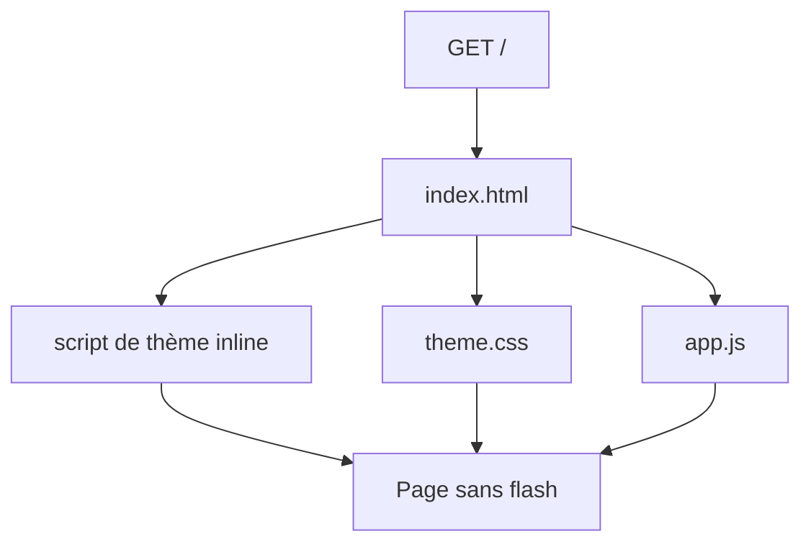
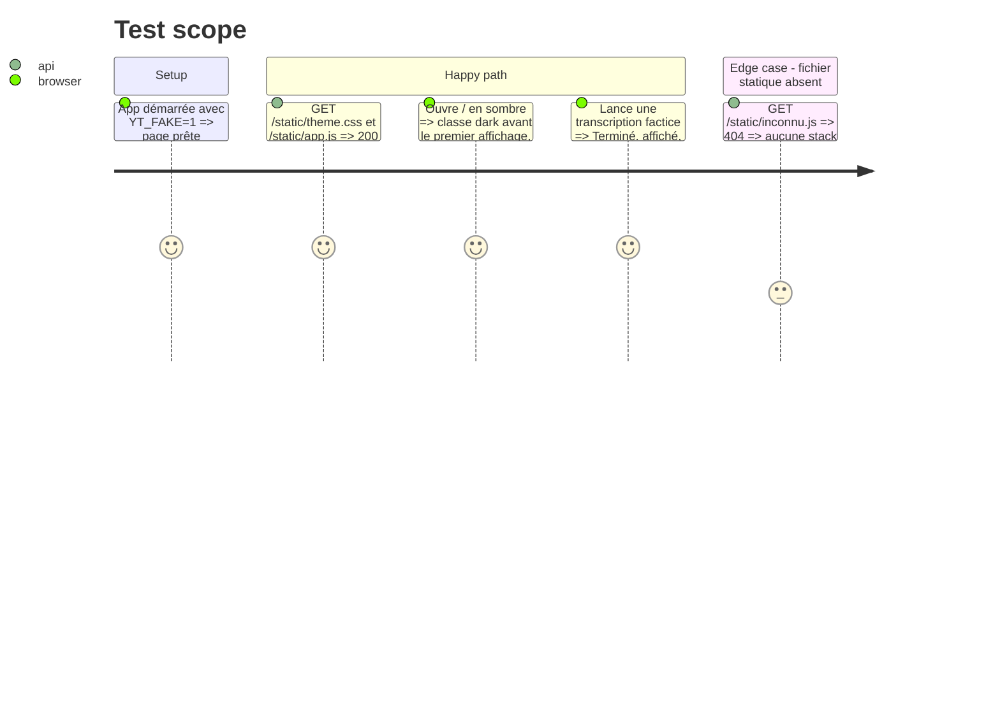

# Instruction: ADR, fichiers statiques et découpage

## Architecture projection

```txt
app/
├── main.py                              ✏️ monte /static avec StaticFiles
└── static/
    ├── index.html                       ✏️ balisage, <link>, scripts, directives Tailwind inline
    ├── theme.css                        ✅ variables de thème et commentaire des ratios
    └── app.js                           ✅ transcription et bouton de thème
tests/
└── test_static.py                       ✅ /static/app.js et /static/theme.css répondent
aidd_docs/memory/
├── internal/decisions/page-files.md     ✅ ADR, écrit avant le code
├── architecture.md                      ✏️ « single HTML page » devient faux
├── codebase-map.md                      ✏️ liste les nouveaux fichiers
└── design.md                            ✏️ les variables vivent dans theme.css
```

## User Journey



## Test Scope



## Tasks to do

### `1)` ADR d'abord

> Une décision d'archi qui s'écarte de l'ADR demande un nouvel ADR avant le code.

1. Écrire `aidd_docs/memory/internal/decisions/page-files.md` (gabarit de `lockfile.md`, contenu en français) : pourquoi on quitte « une seule page HTML » (251 lignes, quatre rôles mêlés), ce qui reste inline et pourquoi (script de thème, directives Tailwind), pas de build front.
2. Marquer en tête que l'ADR précise `stack.md` (ligne « Front »), sans le remplacer.

### `2)` Servir les fichiers statiques

> Aujourd'hui seule `/` est servie.

1. Monter `StaticFiles(directory=STATIC)` sur `/static` dans `create_app`, sans changer les routes existantes.
2. `tests/test_static.py` : 200 sur `theme.css` et `app.js` (type de contenu), 404 propre sur un fichier inconnu.

### `3)` Découper la page

> Même rendu, même comportement.

1. Déplacer les variables `:root` / `.dark` et le commentaire des ratios vers `theme.css`, chargé par `<link rel="stylesheet" href="/static/theme.css">` avant le script Tailwind.
2. Garder dans `index.html` un `<style type="text/tailwindcss">` avec `@custom-variant` et `@theme inline`.
3. Déplacer la logique de transcription et le bouton de thème vers `app.js`, chargé par `<script src="/static/app.js" defer>`. `THEME_KEY` et `systemDark` restent déclarés par le script inline du `<head>`.
4. Ne changer aucune classe, aucun identifiant ni aucun texte.

### `4)` Garder la mémoire vraie

1. `architecture.md`, `codebase-map.md`, `design.md` : retirer « single HTML page », lister `theme.css` et `app.js`, dire que les variables vivent dans `theme.css`.
2. Vérifier `README.md` et `testing.md` pour toute mention d'un fichier unique.

## Test acceptance criteria

| Task | Acceptance criteria                                                                                              |
| ---- | ---------------------------------------------------------------------------------------------------------------- |
| 1    | L'ADR existe et est committé avant les changements de code                                                        |
| 2    | `/static/theme.css` et `/static/app.js` répondent 200, un fichier inconnu répond 404 sans stack trace             |
| 3    | `index.html` ne contient plus de variables de couleur ni de logique de transcription, les captures clair/sombre de la page sont identiques à `main` |
| 3    | `scripts/check.sh` et `scripts/e2e.sh fake` passent, les six scénarios inchangés                                  |
| 4    | `grep -ri "single html page\|une seule page" aidd_docs README.md` ne renvoie plus de phrase fausse                |
