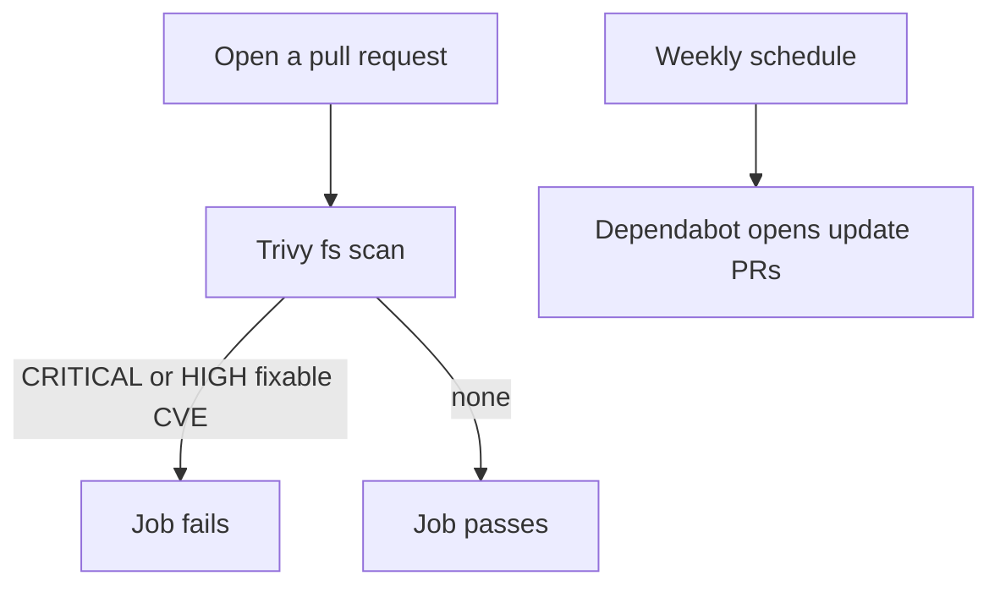
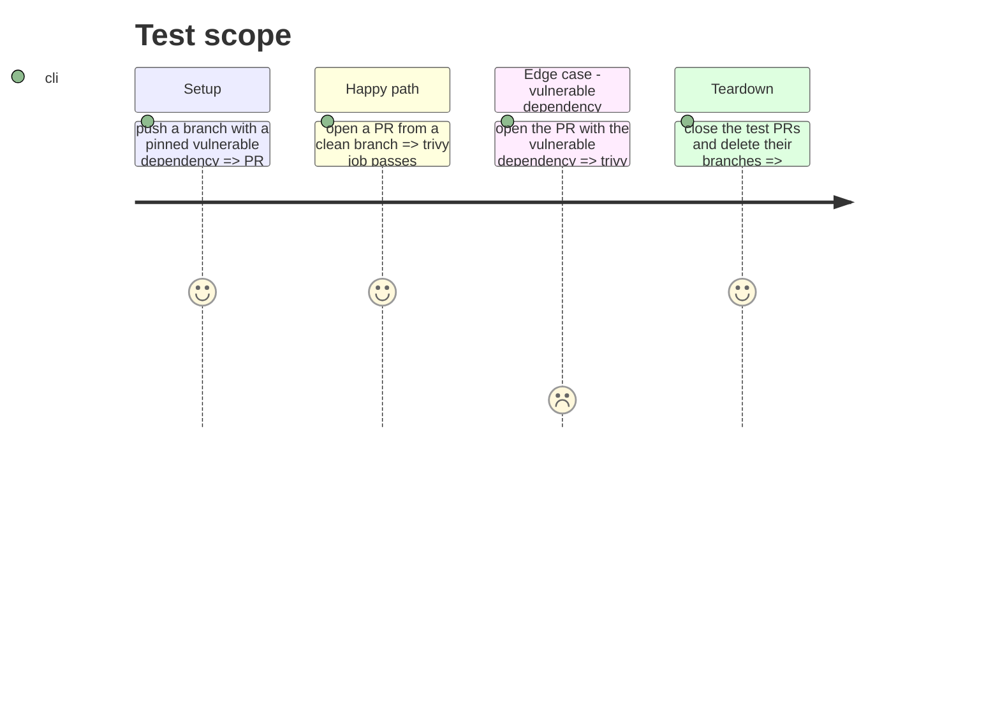

# Instruction: Trivy workflow, Dependabot config, memory

## Architecture projection

> Tree of the final files. ✅ create · ✏️ modify · ❌ delete

```txt
.
├── .github/
│   ├── workflows/trivy.yml          ✅ trivy fs scan on pull_request
│   └── dependabot.yml               ✅ github-actions + pip, weekly
└── aidd_docs/memory/deployment.md   ✏️ "No CI/CD" line no longer true
```

## User Journey



## Test Scope



## Tasks to do

### `1)` Create the Trivy workflow

> Scan the repo filesystem on every pull request.

1. Create `.github/workflows/trivy.yml` from the issue's starter YAML, unchanged SHAs and version comments.
2. Keep `ignore-unfixed: true`, `severity: CRITICAL,HIGH`, `exit-code: '1'`.
3. Keep the SARIF upload step with `if: always()`. If it fails on the first run, remove that step and keep the job failure.

### `2)` Create the Dependabot config

> Weekly updates for the two ecosystems in use.

1. Create `.github/dependabot.yml` from the issue's starter YAML (`github-actions` and `pip`, weekly, directory `/`).
2. Leave `docker` out. The issue leaves it open, and Docker image scanning is excluded from the scope.

### `3)` Keep the memory true

> Update what the change makes false.

1. In `aidd_docs/memory/deployment.md`, replace "No CI/CD" with a line saying there is no build or deploy pipeline, only a Trivy scan on pull requests and Dependabot updates.
2. README has no CI line, nothing to change there.

### `4)` Manual step for the user

> Not doable from the repo.

1. List for the user: enable Dependabot alerts and security updates in Settings > Code security. The exact UI path is not confirmed.

## Test acceptance criteria

| Task | Acceptance criteria                                                                            |
| ---- | ---------------------------------------------------------------------------------------------- |
| 1    | A PR with a deliberately vulnerable dependency fails the `scan` job, a clean PR passes it      |
| 1    | Every `uses:` line carries a 40-character commit SHA and the tag as a comment                  |
| 2    | `.github/dependabot.yml` parses as YAML with two `updates` entries, both weekly                |
| 2    | Dependabot opens an action update PR on its first run                                          |
| 3    | `deployment.md` no longer claims there is no CI/CD                                             |
