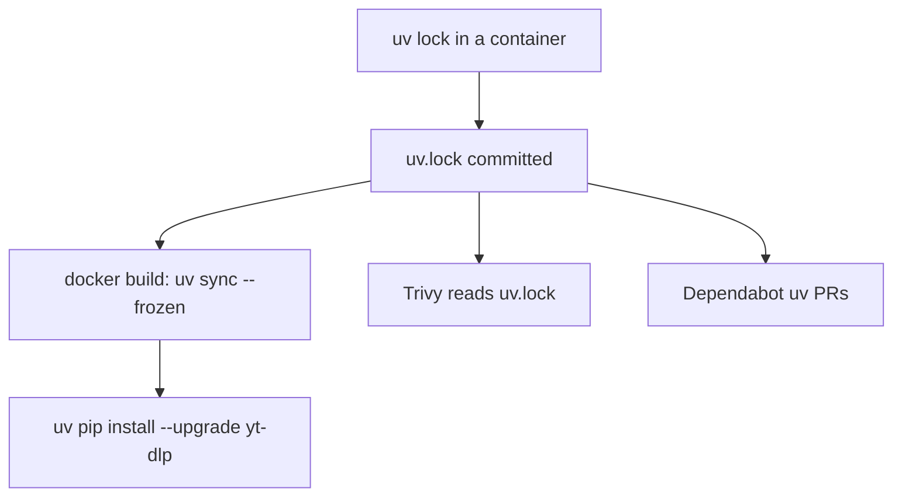
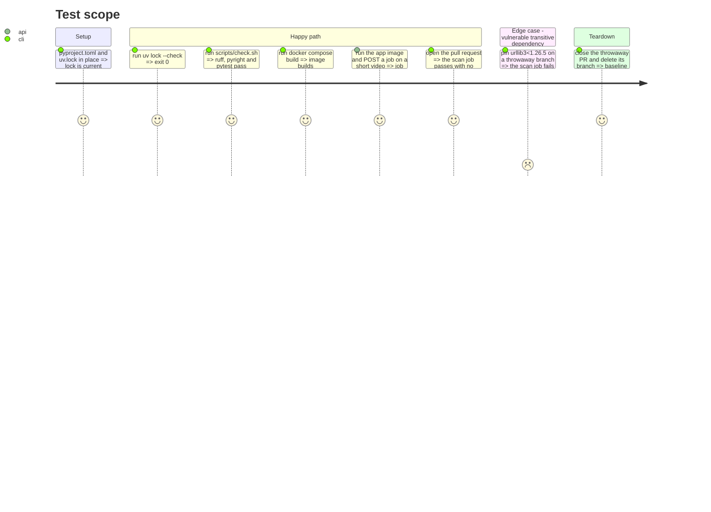

# Instruction: migrate to uv and align CI and memory

## Architecture projection

> Tree of the final files. ✅ create · ✏️ modify · ❌ delete

```txt
.
├── pyproject.toml                          ✏️ add [project], dependency groups dev and gpu, uv package = false
├── uv.lock                                 ✅ generated in a python:3.12-slim container
├── requirements.txt                        ❌ replaced by pyproject.toml
├── requirements-dev.txt                    ❌ replaced by the dev group
├── Dockerfile                              ✏️ uv sync --frozen, then upgrade yt-dlp
├── scripts/check.sh                        ✏️ install with uv, run the tools from the dev group
├── .github/
│   ├── workflows/trivy.yml                 ✏️ drop the "Resolve pinned dependencies" step
│   └── dependabot.yml                      ✏️ pip ecosystem becomes uv
└── aidd_docs/memory/
    ├── architecture.md                     ✏️ "yt-dlp is not pinned" lines
    ├── integration.md                      ✏️ "yt-dlp is not pinned" line
    ├── deployment.md                       ✏️ only if a line became false
    └── internal/decisions/stack.md         ✏️ "Audio" row points to lockfile.md
```

## User Journey



## Test Scope



## Tasks to do

### `1)` Declare the dependencies

> One manifest, two groups.

1. In `pyproject.toml` add `[project]` (name, version, `requires-python = ">=3.12"`) with the six runtime dependencies of `requirements.txt`, keeping `faster-whisper==1.2.1` and `av>=15,<16`.
2. Add `[dependency-groups]`: `dev` (pytest, pytest-cov, httpx, ruff, `pyright[nodejs]`) and `gpu` (`nvidia-cublas-cu12`, `nvidia-cudnn-cu12==9.*`).
3. Add `[tool.uv] package = false`. Keep the existing ruff, pyright, pytest and coverage sections unchanged.

### `2)` Generate the lock

> No uv on the host, so use a container.

1. Run `uv lock` in a `python:3.12-slim` container after `pip install uv`, copy `uv.lock` out, and record the uv version used.
2. Check `uv lock --check` passes and `av` resolves to `15.x`.

### `3)` Switch the Dockerfile

> Same image behavior, locked install.

1. Install `uv` pinned to the version from task 2, set `UV_PROJECT_ENVIRONMENT=/opt/venv`, `VIRTUAL_ENV=/opt/venv`, `PATH=/opt/venv/bin:$PATH`.
2. `COPY pyproject.toml uv.lock`, run `uv sync --frozen --no-install-project --no-dev --group gpu` (`--no-dev`, otherwise the dev group lands in the image: +0.4 GB), then `uv pip install --upgrade yt-dlp`.
3. Keep the comment about `yt-dlp`, reworded: locked, upgraded at build. Keep the rest of the file unchanged.

### `4)` Switch the check chain

> Same four steps, same order.

1. In `scripts/check.sh`, replace `pip install -q -r requirements-dev.txt` with `pip install -q uv` then `uv sync --frozen --group dev`, and run ruff, pyright and pytest from that environment.
2. Keep the step echoes, `--fast` behavior and the read-only mount.

### `5)` Align CI

> Trivy reads the lock, Dependabot follows uv.

1. In `trivy.yml` delete the "Resolve pinned dependencies" step and its comment.
2. In `dependabot.yml` change `package-ecosystem: pip` to `uv`, keep `directory: /` and weekly.

### `6)` Remove the old manifests

1. Delete `requirements.txt` and `requirements-dev.txt`.

### `7)` Keep the memory true

> Update what the change makes false.

1. `architecture.md` and `integration.md`: `yt-dlp` is locked in `uv.lock` and upgraded at build, a `--no-cache` rebuild still follows YouTube.
2. `stack.md` row "Audio": point to `lockfile.md`.
3. Grep README and `aidd_docs/memory/` for `requirements` and "not pinned", fix every line that became false. `e2e/requirements.txt` stays.

## Test acceptance criteria

| Task | Acceptance criteria                                                                          |
| ---- | -------------------------------------------------------------------------------------------- |
| 1, 2 | `uv lock --check` exits 0, `av` is `15.x` in `uv.lock`                                       |
| 3    | `docker compose build` succeeds, a job on a short video reaches `done` on GPU                |
| 4    | `scripts/check.sh` passes the four steps                                                      |
| 5    | the `scan` job passes on the PR with no resolve step, and fails on a throwaway vulnerable pin |
| 6    | `git ls-files` lists neither `requirements.txt` nor `requirements-dev.txt`                   |
| 7    | `grep -rn "requirements" README.md aidd_docs/memory` only returns `e2e/requirements.txt`     |
