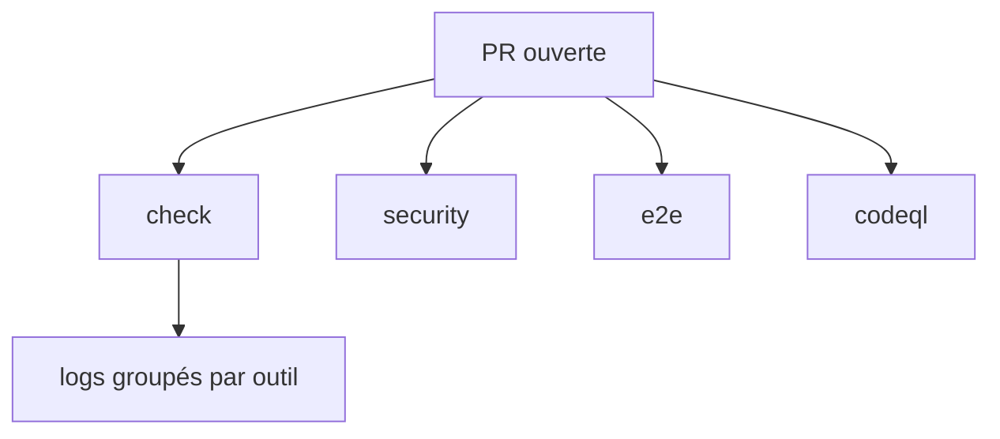
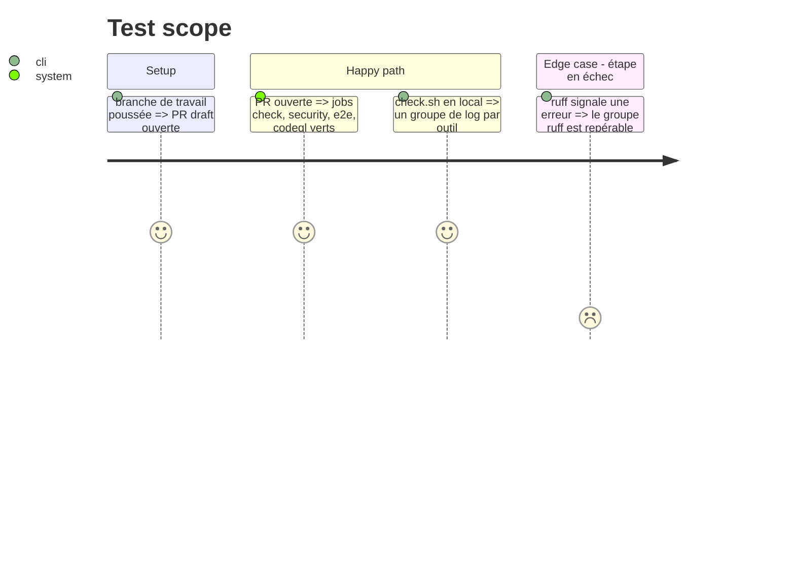

# Instruction: dépôt yt-transcriber, noms du contrat, CodeQL, `check.sh`

## Architecture projection

```txt
.
├── .github/workflows/
│   ├── ci.yml        ✏️ jobs `check` et `e2e` (noms courts)
│   ├── trivy.yml     ✏️ job `scan` devient `security`
│   └── codeql.yml    ✅ Python et actions, non requis
├── scripts/check.sh  ✏️ `::group::` par outil
├── README.md         ✏️ section CI
└── aidd_docs/memory/ ✏️ deployment.md, testing.md, coding-assertions.md (noms des jobs, CodeQL)
```

## User Journey



## Test Scope



## Tasks to do

### `1)` Mesurer le surcoût d'une étape par outil

> Décider entre `::group::` et une étape de workflow par outil sur une mesure.

1. Chronométrer `scripts/check.sh` complet, puis le conteneur lancé trois fois pour trois étapes (setup `uv sync` compris).
2. Noter les deux durées dans le corps de la PR.
3. Garder `::group::` si le surcoût dépasse 20 % du temps total, sinon une étape par outil.

### `2)` Renommer les jobs et ajouter CodeQL

> Les noms du contrat, aucun nom de stack.

1. `ci.yml` : `name: check` et `name: e2e`.
2. `trivy.yml` : job `security`, `name: security`.
3. `codeql.yml` : `github/codeql-action` épinglé par SHA, langages `python` et `actions`, `permissions` minimales (`security-events: write`).

### `3)` Grouper les logs de `check.sh`

> Une étape en échec se repère d'un coup d'œil.

1. Encadrer chaque outil par `::group::<outil>` et `::endgroup::`.
2. Garder le comportement `set -e` et `--fast` inchangés.

### `4)` Tenir la mémoire vraie

1. Mettre à jour `deployment.md`, `testing.md`, `coding-assertions.md` et le README là où ils citent les anciens noms ou ignorent CodeQL.

## Test acceptance criteria

| Task | Acceptance criteria |
| ---- | ------------------- |
| 1    | la PR donne les deux durées et le choix retenu |
| 2    | sur la PR, les jobs `check`, `security`, `e2e` et `codeql` s'affichent et passent |
| 3    | `scripts/check.sh` affiche un groupe par outil, et `--fast` s'arrête après `pyright` |
| 4    | `grep -rn "scan\|ruff, pyright" aidd_docs README.md` ne renvoie plus l'ancien nom |
