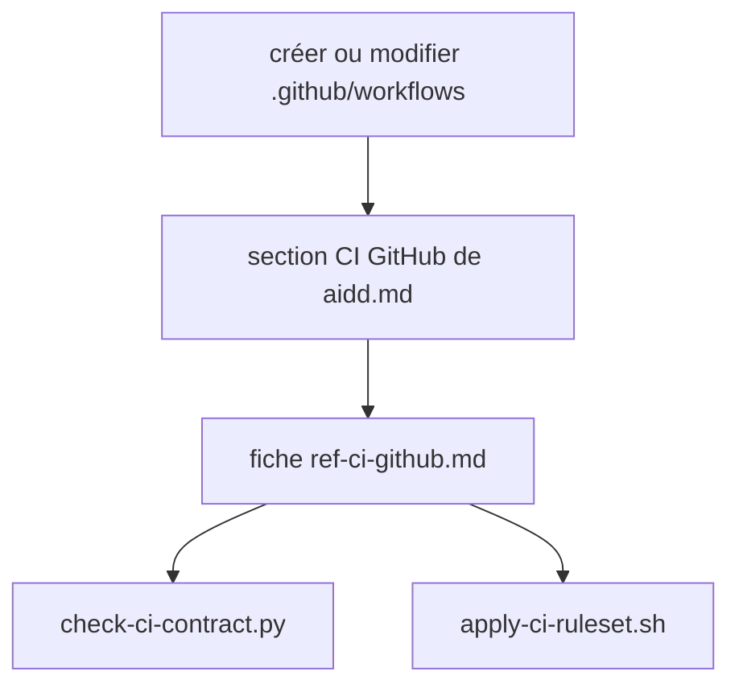
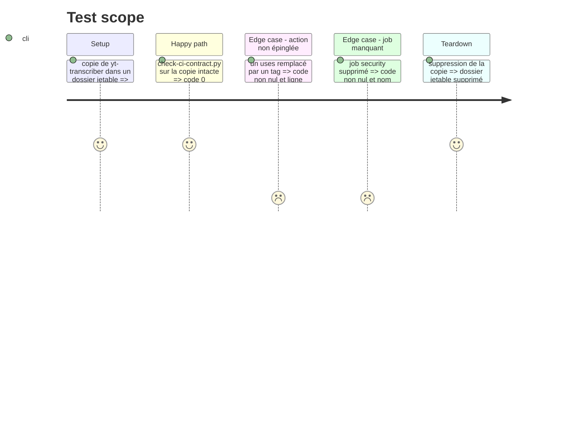

# Instruction: agent-config, fiche, section `aidd.md`, scripts

## Architecture projection

> Dépôt `~/Developpement/Workspaces/AI/agent-config`, branche dédiée.

```txt
.
├── rules/aidd.md                                       ✏️ section « CI GitHub »
├── rules/references/ref-ci-github.md                   ✅ la fiche complète
└── wrappers/claude/scripts/
    ├── check-ci-contract.py                            ✅ script de conformité
    ├── apply-ci-ruleset.sh                             ✅ applique le ruleset via gh
    └── tests/test-check-ci-contract.py                 ✅ cas conforme et cas en défaut
```

## User Journey



## Test Scope



## Tasks to do

### `1)` Rédiger la fiche

> Le contrat tient en une page qu'un agent applique sans deviner.

1. Jobs obligatoires et noms exacts : `check`, `security`, `e2e` (présent seulement si le dépôt a des tests navigateur).
2. Un seul job `check`, chaque outil en étape ou en groupe de logs.
3. Actions épinglées par SHA de 40 caractères avec le tag en commentaire, `permissions: contents: read` en tête, élargie par job.
4. Dependabot sur l'écosystème `github-actions`.
5. CodeQL : `codeql.yml` à part, gratuit en dépôt public, GitHub Code Security requis en privé (doc vérifiée le 2026-10-07), non requis par le ruleset.
6. Hors contrat : workflows partagés, templates par stack, CD (workflow séparé déclenché après fusion).

### `2)` Ajouter la section à `rules/aidd.md`

> Déclencheur : créer ou modifier `.github/workflows/` ou le ruleset. Renvoie vers la fiche, pas de copie du contrat.

### `3)` Écrire le script de conformité

> Mesure le contrat de façon déterministe, échoue fermé.

1. Lire les workflows en YAML, vérifier les noms de jobs, les `uses:` épinglés par SHA, les permissions et Dependabot.
2. Sortie : une ligne par écart avec fichier et ligne, code de sortie non nul.

### `4)` Écrire le script du ruleset

> Les trois contextes requis, rien d'autre.

1. `gh api` crée ou met à jour le ruleset avec `check`, `security`, `e2e` selon un argument.
2. Mode `--dry-run` qui affiche le JSON envoyé.

## Test acceptance criteria

| Task | Acceptance criteria |
| ---- | ------------------- |
| 1    | la fiche liste les trois noms exacts et la mention du prix de CodeQL |
| 2    | la section renvoie à la fiche et ne recopie aucun critère |
| 3    | code 0 sur une copie conforme, non nul avec la ligne fautive quand un `uses:` est un tag ou une branche |
| 4    | `--dry-run` n'affiche que les trois contextes du contrat |
