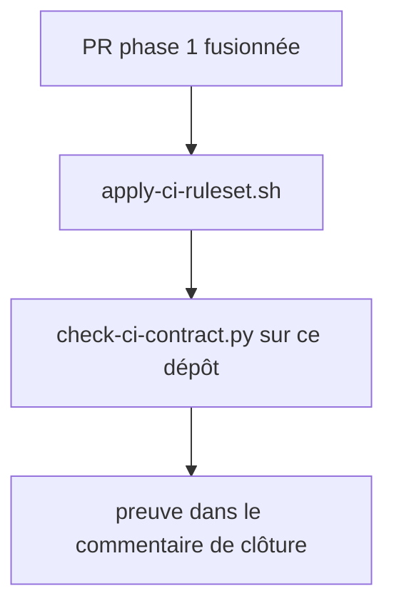
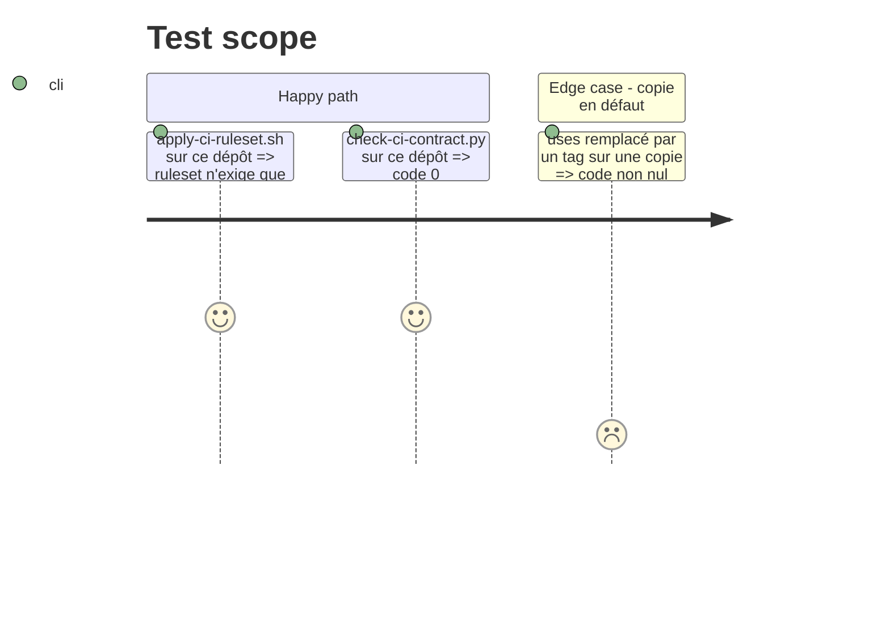

# Instruction: ruleset appliqué, conformité prouvée sur ce dépôt

> Démarre avant la fusion de la PR #44 : les nouveaux noms y ont déjà rapporté, et le ruleset (sans acteur de contournement) bloque sinon la fusion sur les anciens contextes.

## Architecture projection

```txt
.
└── (ruleset GitHub 24662094)  ✏️ contextes requis : check, security, e2e
```

## User Journey



## Test Scope



## Tasks to do

### `1)` Appliquer le ruleset

1. Lancer `--dry-run`, relire, puis appliquer sur `kevpdev/yt-transcriber`.
2. Relire le ruleset avec `gh api` et comparer aux trois noms.

### `2)` Prouver la conformité

1. Lancer le script sur ce dépôt, puis sur une copie où un `uses:` est un tag.
2. Coller commandes et sorties dans le commentaire de clôture de l'issue.

## Test acceptance criteria

| Task | Acceptance criteria |
| ---- | ------------------- |
| 1    | le ruleset ne liste que `check`, `security`, `e2e` |
| 2    | code 0 sur le dépôt, code non nul sur la copie en défaut, sorties dans le commentaire de clôture |
