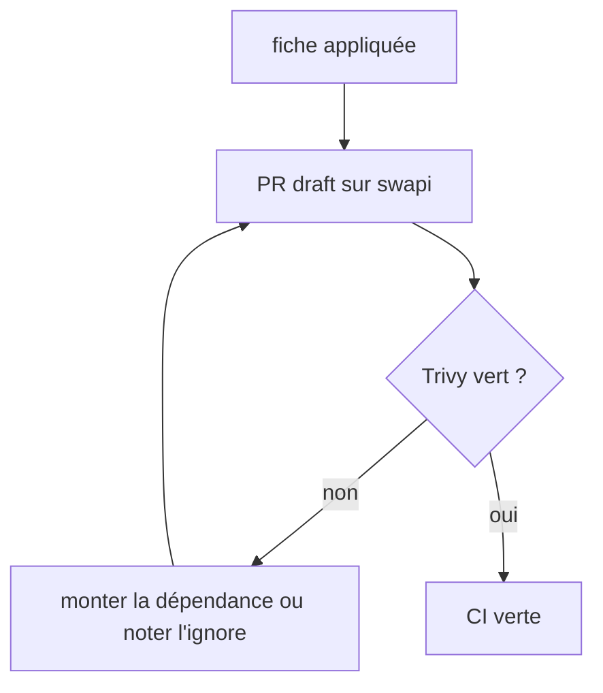
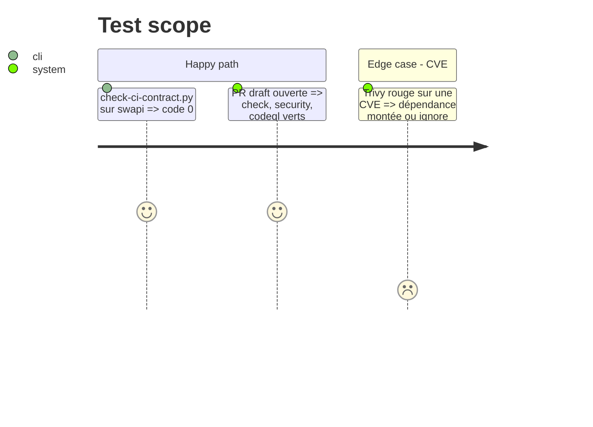

# Instruction: application à `kevpdev/swapi`

## Architecture projection

> Dépôt `kevpdev/swapi` (Java 21, Maven), branche et PR draft.

```txt
.
├── .github/
│   ├── workflows/ci.yml        ✅ job `check` (`sh ./mvnw verify`)
│   ├── workflows/trivy.yml     ✅ job `security`
│   ├── workflows/codeql.yml    ✅ java-kotlin et actions
│   └── dependabot.yml          ✅ github-actions et maven
└── pom.xml                     ✏️ seulement si Trivy remonte une CVE à corriger
```

## User Journey



## Test Scope



## Tasks to do

### `1)` Poser la CI de la fiche

1. Cloner `swapi`, créer la branche, écrire les quatre fichiers d'après la fiche (pas d'`e2e`, pas de tests navigateur).
2. Épingler chaque action par SHA, mêmes SHA que ce dépôt.

### `2)` Rejouer jusqu'au vert

1. Ouvrir la PR draft, lire le premier Trivy.
2. Monter les dépendances ou consigner ce qu'on ignore, avec la raison.
3. Appliquer le ruleset (`check` et `security` seulement).

### `3)` Clore l'issue

1. Poster dans le commentaire de clôture le lien de la PR swapi, la sortie du script et les CVE traitées.

## Test acceptance criteria

| Task | Acceptance criteria |
| ---- | ------------------- |
| 1    | `check-ci-contract.py` renvoie 0 sur swapi |
| 2    | `gh pr checks` sur la PR swapi montre `check`, `security` et `codeql` verts |
| 3    | le commentaire de clôture de #40 cite la PR, la sortie du script et les CVE |
